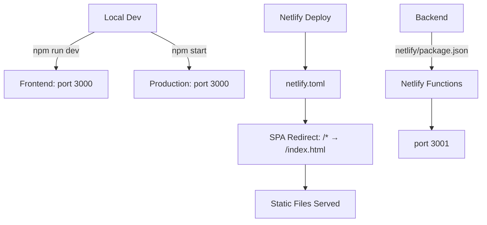

# Flow: Deployment Architecture

Core deployment flow diagram

## Deployment Flow

```mermaid
flowchart TD
    A[Local Dev] -->|npm run dev| B[Frontend: port 3000]
    A -->|npm start| C[Production: port 3000]
    D[Netlify Deploy] --> E[netlify.toml]
    E --> F[SPA Redirect: /* → /index.html]
    F --> G[Static Files Served]
    H[Backend] -->|netlify/package.json| I[Netlify Functions]
    I --> J[port 3001]
```

[[config-deploy]]
