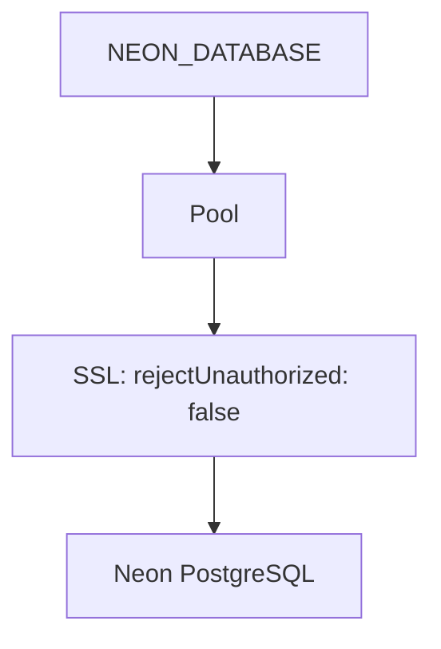

# 1. Connection Pool

PostgreSQL connection pool with Neon SSL config

**Purpose:** PostgreSQL connection pool using `pg` library with Neon database URL. SSL configured with `rejectUnauthorized: false`.

```javascript
const pool = new Pool({
  connectionString: process.env.NEON_DATABASE,
  ssl: { rejectUnauthorized: false }
});
```

## Diagram



### NOTES

- SSL bypass is security trade-off
- No max/min pool size configured

[[database-layer]]
