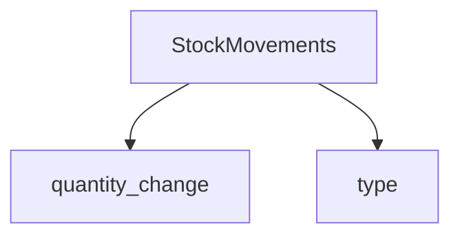

# 7. Inventory Tracking

Stock movements audit trail

**Table:** `stock_movements`

Inventory change audit trail.

**Columns:** product_id, quantity_change, type (sale, restock, adjustment), reference_id, notes, created_at

**Index:** idx_stock_movements_product_id

## Diagram

### NOTES

- No auto trigger on order
- type plain text

[[database-layer]]
