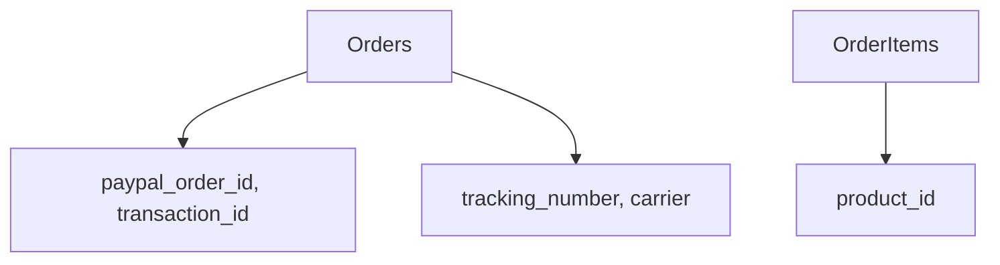

# 6. Order Management

Orders + items with PayPal tracking

**Tables:** `orders` + `order_items`

Order management with PayPal integration.

**orders:** user, status, total, shipping, PayPal (order_id, transaction_id), tracking, notes

**order_items:** order_id, product_id, quantity, unit_price

## Diagram

### NOTES

- No order status history
- Status plain text

[[database-layer]]
