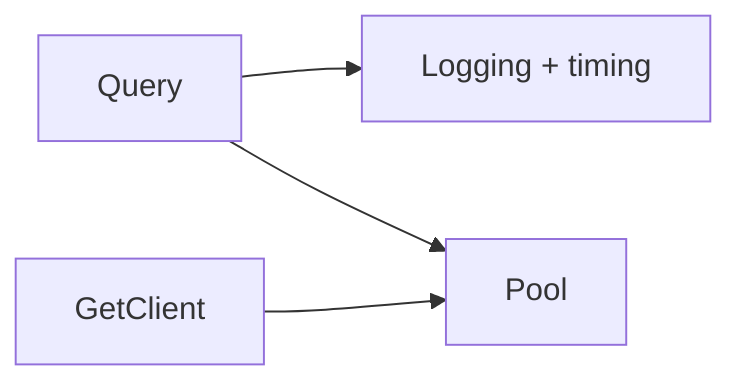

# 2. Query Utilities

query() and getClient() helpers with logging

**Purpose:** Helper functions for database operations.

- `query(text, params)` - Execute queries with logging
- `getClient()` - Get client for transactions

```javascript
const result = await query('SELECT * FROM products');
```

## Diagram



### NOTES

- Logs query duration
- No prepared statement caching

[[database-layer]]
