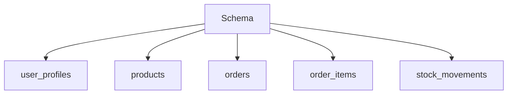

# 3. Schema Definition

5 tables, 5 indexes, sample data

**Purpose:** Complete database schema.

**5 Tables:** user_profiles, products, orders, order_items, stock_movements

**5 Indexes:** user_id, status, order_id, product_id, neon_user_id

**Sample data:** 6 sour fig products

## Diagram

### NOTES

- image_url never populated
- No auto timestamps

[[database-layer]]
